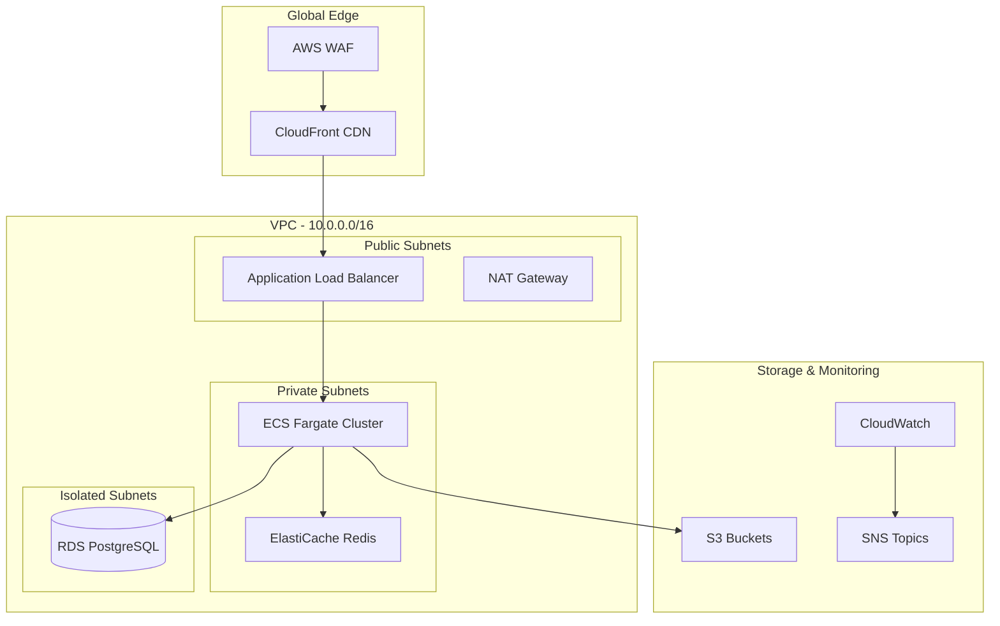
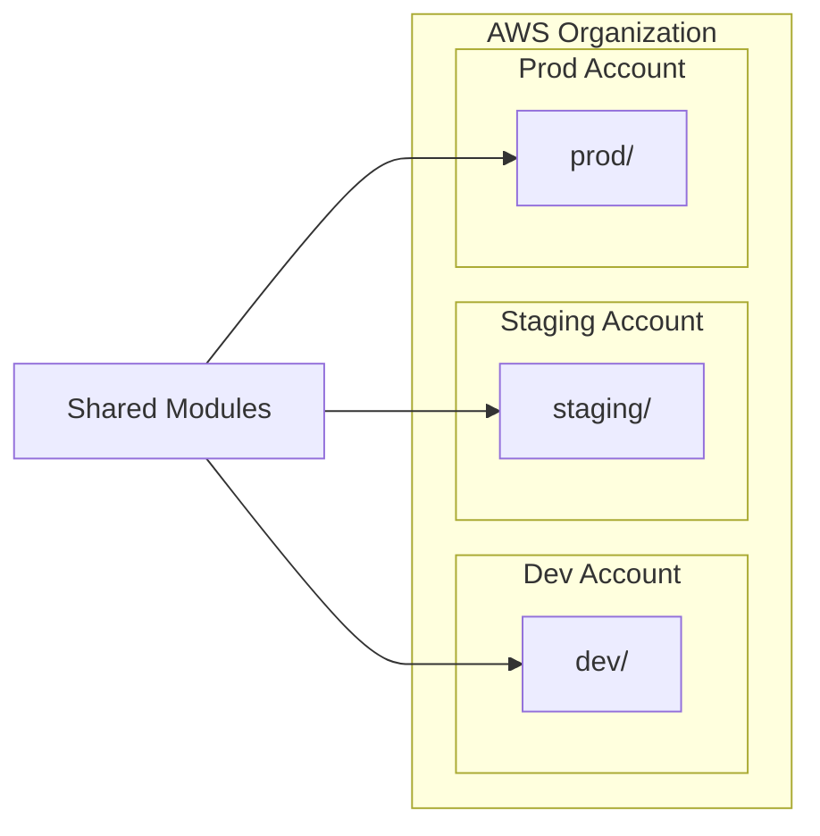

# 🏗️ aws-infra-platform

[](.github/workflows/terraform-ci.yml)
[](.github/workflows/terraform-apply.yml)
[](LICENSE)
[](https://www.terraform.io/)
[](https://aws.amazon.com/)

**Enterprise-grade AWS infrastructure platform** built with modular Terraform. Provisions a complete production stack — VPC, ECS Fargate, RDS PostgreSQL, ElastiCache Redis, ALB, CloudFront CDN, WAF, and S3 — with remote state management, security hardening, cost controls, and multi-environment support.

---

## 📋 Table of Contents

- [Architecture](#architecture)
- [Features](#features)
- [Module Inventory](#module-inventory)
- [Prerequisites](#prerequisites)
- [Quick Start](#quick-start)
- [Project Structure](#project-structure)
- [Environment Management](#environment-management)
- [Security](#security)
- [Cost Optimization](#cost-optimization)
- [Contributing](#contributing)
- [License](#license)

---

## 🏗️ Architecture



### Multi-Environment Layout



---

## ✨ Features

### Modular Architecture
- **9 reusable Terraform modules** — VPC, ECS, RDS, ElastiCache, ALB, CloudFront, S3, IAM, Monitoring
- **DRY configuration** — environments call shared modules with different parameters
- **Versioned modules** — pin module versions for stability

### Multi-Environment
- **Isolated environments** — dev, staging, and prod with separate state files
- **Environment-specific sizing** — right-sized resources per environment
- **Consistent infrastructure** — same modules ensure parity across environments

### Security Hardening
- **Encryption everywhere** — KMS encryption for RDS, S3, EBS, and ElastiCache
- **Network isolation** — private subnets, security groups, NACLs
- **WAF protection** — OWASP Top 10 rule sets on CloudFront
- **IAM least privilege** — scoped roles and policies
- **VPC Flow Logs** — network traffic auditing
- **GuardDuty** — threat detection

### Cost Optimization
- **OPA/Sentinel policies** — enforce instance type and sizing constraints
- **Auto-scaling** — ECS service auto-scaling based on CPU/memory
- **S3 lifecycle policies** — automated data tiering
- **Spot instances** — optional Fargate Spot for non-production

### Observability
- **CloudWatch dashboards** — per-service and aggregate dashboards
- **CloudWatch alarms** — CPU, memory, disk, error rate, latency
- **SNS notifications** — email, Slack, and PagerDuty integrations
- **Access logging** — ALB, CloudFront, and S3 access logs

---

## 📦 Module Inventory

| Module | Description | Resources Created |
|--------|-------------|-------------------|
| **vpc** | Network foundation | VPC, subnets (public/private/isolated), NAT GW, IGW, route tables, flow logs, NACLs |
| **ecs** | Container platform | ECS cluster, task definitions, services, auto-scaling, capacity providers |
| **rds** | Managed database | RDS PostgreSQL, parameter groups, subnet groups, encryption, automated backups, multi-AZ |
| **elasticache** | In-memory cache | ElastiCache Redis cluster, subnet groups, parameter groups, encryption |
| **alb** | Load balancing | ALB, target groups, listeners, HTTPS redirect, health checks, access logs |
| **cloudfront** | Content delivery | CloudFront distribution, origin access identity, cache policies, WAF integration |
| **s3** | Object storage | S3 buckets, versioning, encryption, lifecycle rules, CORS, access logging |
| **iam** | Identity & access | IAM roles, policies, instance profiles, OIDC providers |
| **monitoring** | Observability | CloudWatch dashboards, alarms, log groups, SNS topics, metric filters |

### Estimated Monthly Cost

| Environment | Estimated Cost | Notes |
|-------------|----------------|-------|
| Dev | ~$150/mo | Single-AZ RDS, minimal ECS tasks, no NAT HA |
| Staging | ~$400/mo | Multi-AZ RDS (small), moderate ECS tasks |
| Production | ~$1,200/mo | Multi-AZ everything, HA NAT, larger instances |

*Costs are approximate and vary by region and usage.*

---

## 📦 Prerequisites

| Tool | Version | Purpose |
|------|---------|---------|
| [AWS CLI](https://aws.amazon.com/cli/) | >= 2.x | AWS authentication |
| [Terraform](https://www.terraform.io/) | >= 1.5 | Infrastructure provisioning |
| [tfsec](https://github.com/aquasecurity/tfsec) | >= 1.28 | Security scanning |
| [checkov](https://www.checkov.io/) | >= 3.0 | Compliance scanning |

---

## 🚀 Quick Start

### 1. Bootstrap Remote State

```bash
cd backend/
terraform init
terraform apply
```

### 2. Deploy an Environment

```bash
# Deploy dev environment
make plan ENV=dev
make apply ENV=dev

# Deploy staging
make plan ENV=staging
make apply ENV=staging

# Deploy production (requires approval)
make plan ENV=prod
make apply ENV=prod
```

### 3. Verify

```bash
# Check ALB endpoint
make output ENV=dev

# Run health check
make health ENV=dev
```

---

## 📁 Project Structure

```
aws-infra-platform/
├── .github/
│   ├── workflows/
│   │   ├── terraform-ci.yml          # Validate, plan, security scan
│   │   └── terraform-apply.yml       # Apply with environment gates
│   ├── ISSUE_TEMPLATE/
│   │   ├── bug_report.yml
│   │   └── feature_request.yml
│   └── PULL_REQUEST_TEMPLATE.md
├── modules/
│   ├── vpc/                           # VPC, subnets, NAT, flow logs
│   │   ├── main.tf
│   │   ├── variables.tf
│   │   └── outputs.tf
│   ├── ecs/                           # ECS Fargate cluster & services
│   │   ├── main.tf
│   │   ├── variables.tf
│   │   └── outputs.tf
│   ├── rds/                           # RDS PostgreSQL
│   │   ├── main.tf
│   │   ├── variables.tf
│   │   └── outputs.tf
│   ├── elasticache/                   # Redis cluster
│   │   ├── main.tf
│   │   ├── variables.tf
│   │   └── outputs.tf
│   ├── alb/                           # Application Load Balancer
│   │   ├── main.tf
│   │   ├── variables.tf
│   │   └── outputs.tf
│   ├── cloudfront/                    # CDN + WAF
│   │   ├── main.tf
│   │   ├── variables.tf
│   │   └── outputs.tf
│   ├── s3/                            # S3 buckets
│   │   ├── main.tf
│   │   ├── variables.tf
│   │   └── outputs.tf
│   ├── iam/                           # IAM roles & policies
│   │   ├── main.tf
│   │   ├── variables.tf
│   │   └── outputs.tf
│   └── monitoring/                    # CloudWatch, SNS
│       ├── main.tf
│       ├── variables.tf
│       └── outputs.tf
├── environments/
│   ├── dev/
│   │   ├── main.tf
│   │   ├── variables.tf
│   │   ├── outputs.tf
│   │   ├── providers.tf
│   │   └── terraform.tfvars
│   ├── staging/
│   │   ├── main.tf
│   │   ├── variables.tf
│   │   ├── outputs.tf
│   │   ├── providers.tf
│   │   └── terraform.tfvars
│   └── prod/
│       ├── main.tf
│       ├── variables.tf
│       ├── outputs.tf
│       ├── providers.tf
│       └── terraform.tfvars
├── backend/
│   └── main.tf                        # S3 + DynamoDB state backend
├── policies/
│   ├── cost-controls.rego             # OPA cost policies
│   └── security-baseline.rego         # OPA security policies
├── Makefile
├── .gitignore
├── CHANGELOG.md
├── CODE_OF_CONDUCT.md
├── CONTRIBUTING.md
├── LICENSE
├── SECURITY.md
└── README.md
```

---

## 🌍 Environment Management

### Environment Sizing

| Resource | Dev | Staging | Production |
|----------|-----|---------|------------|
| ECS Tasks | 1 | 2 | 3-10 (auto-scaled) |
| ECS CPU/Mem | 256/512 | 512/1024 | 1024/2048 |
| RDS Instance | db.t3.micro | db.t3.small | db.r6g.large |
| RDS Multi-AZ | No | Yes | Yes |
| Redis Nodes | 1 | 2 | 3 (cluster mode) |
| NAT Gateways | 1 | 2 | 3 (per AZ) |
| CloudFront | No | No | Yes + WAF |

---

## 🔒 Security

See [SECURITY.md](SECURITY.md) for our security policy.

### Security Controls

- **Network**: VPC isolation, security groups, NACLs, private subnets
- **Encryption**: KMS encryption for RDS, S3, EBS, ElastiCache, CloudWatch Logs
- **Identity**: IAM least-privilege, OIDC federation, no long-lived credentials
- **Detection**: GuardDuty, VPC Flow Logs, CloudTrail, Config Rules
- **Protection**: WAF with OWASP rules, DDoS protection via Shield Standard

---

## 💰 Cost Optimization

- **Right-sizing**: Environment-specific instance types
- **Auto-scaling**: ECS scales based on demand
- **Spot capacity**: Fargate Spot for dev/staging (up to 70% savings)
- **Storage tiering**: S3 lifecycle policies (Standard → IA → Glacier)
- **Policy enforcement**: OPA policies prevent over-provisioning

---

## 🤝 Contributing

See [CONTRIBUTING.md](CONTRIBUTING.md) for guidelines on module development.

---

## 📄 License

MIT License — see [LICENSE](LICENSE) for details.

---

## 👤 Author

**Isaiah Ahmed** — [@iahcmd](https://github.com/iahcmd)

> DevOps | Cloud | Infrastructure — Building, automating, and maintaining reliable infrastructure.
